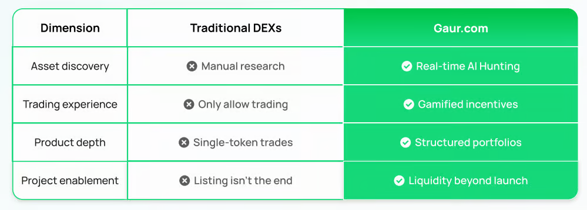

# Gaur.com

_**Gaur.com is an AI-powered, gamified on-chain financial engine** dedicated to transforming the on-chain trading experience and pioneering a new era of intelligent finance. By integrating a comprehensive trading interface with a user-centric decentralized ecosystem and robust incentive mechanisms, Gaur.com aims to set a new standard for the future of decentralized finance._

***

**OPPORTUNITIES**

_1 - BNB Chain TVL grew by 58.2% YoY,
&#x20;with 4.7 million active users._

_2 - Traditional DEX growth slowed by
&#x20;15.7%, signaling demand for a
&#x20;better experience._

_3 - DeFi sees 220 million monthly
&#x20;active addresses, accounting for
&#x20;34% of all crypto addresses._

_**On-chain finance is entering a critical phase
&#x20;of intelligent and gamified transformation.**_

***

**WHAT WE’RE BUILDING**

_1 - AI Alpha Hunt Engine: Real-time scan of 300+ on-chain
&#x20;metrics to generate dynamic token
&#x20;health scores._

_2 - Gamified Trading System: Each trade = points, achievements,
&#x20;NFTs - unlocking gamified USDT prize
&#x20;pools._

_3 - On-chain ETFs and smart
&#x20;leveraged tokens: Auto-managed multi-asset
&#x20;portfolios with efficient, liquidation free leverage._

***

**OUR VISION**

_1 - Asset discovery - Beyond manual research - AI filters in real time
&#x20;Trading experience._

_2 - Beyond basic buy-sell - gameplay-driven flow
&#x20;Financial products._

_3 - Beyond single tokens - structured asset portfolios._

***

**TRADITONAL VS INNOVATION**

<figure><figcaption></figcaption></figure>

**Asset Discovery**

_**Traditional DEXs**:_\
_Users must manually sift through hundreds of tokens, rely on social media, and do extensive due diligence themselves. This often leads to missed opportunities or exposure to risky assets._

_**Gaur.com**:_\
_Our AI-powered "Real-time AI Hunting" engine scans the entire blockchain ecosystem 24/7 to identify trending tokens, early-stage gems, and abnormal trading signals—giving users a constant stream of actionable insights without the grind._

**Trading Experience**

_**Traditional DEXs:**_\
_Trading is a flat, transactional experience. You buy, sell, and hope. There’s no engagement, feedback loop, or sense of progress._

_**Gaur.com:**_\
_We transform trading into an interactive game. Users earn points, unlock achievements, and participate in trading missions—making every transaction rewarding beyond profit. This "Gamified Incentives" system keeps users engaged and motivated._

**Product Depth**

**Traditional DEXs:**\
&#xNAN;_&#x4D;ost offer only basic token-to-token swaps. No way to diversify, hedge, or manage exposure within one transaction._

**Gaur.com:**\
&#xNAN;_&#x57;ith "Structured Portfolios", users can invest in themed baskets (e.g., AI tokens, Meme coins, DeFi leaders), dynamically rebalanced based on market trends and AI analysis. This introduces professional-grade strategies to everyday traders._

**Project Enablement**

**Traditional DEXs:**\
&#xNAN;_&#x4F;nce a token is listed, support ends. Projects are left to fend for themselves, often leading to liquidity death and user attrition._

**Gaur.com:**\
&#xNAN;_&#x57;e offer “Liquidity Beyond Launch” — a suite of post-launch tools including liquidity farming, AI-driven exposure campaigns, performance dashboards, and community trading events. Projects get sustained support and visibility long after listing._

***

**POINT BASED ECONOMIC SYSTEM**

_**The growth of platform transaction volume drives the growth flywheel.**_

Design Logic:

* _**Dynamic Emissions**:_ Point output adjusts with platform activity and market conditions
* _**Anti-Fraud Protection**:_ Smart detection to prevent abuse or bot farming
* _**Level-Up Mechanics**:_ Higher points unlock account levels and exclusive benefits

How to Earn Points?

* _**Trading**: Earn points for every transaction based on volume and frequency._
* _**Referrals**: Invite friends and earn when they start trading._

What Can You Do with Points?

* _Redeem Cash Rewards_
* _Swap Future $GAUR_
* _Claim Physical Entitlements_
* _....._

***

**ROAD MAP**

**Q2 2025: AI Alpha Hunt Engine**

* _Real-time on-chain data analysis and smart money activity tracking._
* _AI-driven signal scoring and prioritization._
* _Personalized signal notifications tailored to individual user preferences and trading styles._
* _Transparent signal provenance ensuring data reliability._

**Q3 2025: Gamified Trading System**

* _Points-based reward system where users earn points through trading activities._
* _Mission and achievement systems designed to encourage sustained engagement._
* _Points redemption store offering a variety of rewards and exclusive privileges._

**Q4 2025: On-chain ETFs and Smart Leveraged Tokens**

* _Multi-asset index ETFs with automated portfolio rebalancing._
* _Smart leveraged tokens featuring built-in risk control and stop-loss mechanisms._
* _Transparent on-chain asset compositions and transaction histories._
* _Support for user-customizable strategy portfolios and leverage configurations._

***

**TEAM**

[**Boz - Co-Founder - CEO** ](https://x.com/0xBozwang)

_A serial entrepreneur with extensive experience in blockchain startups. A product expert, Boz is highly sensitive to cutting-edge innovations in the Web3 space. He is dedicated to advancing Game.com's global strategy and platform development._

**AI Algorithms**

_Former engineers from Google Brain and Cheetah Mobile._

**Derivatives Design**
\
&#xNAN;_&#x43;ore team members from Deribit and BitMEX._

**Game Design**
\
&#xNAN;_&#x54;op-tier game economy designers._

***

**WHY US**

**Technical Moat**

* _Leverages advanced **AI-driven signal system** for precise and efficient trade opportunity detection._
* _Combines innovative **structured financial products** to enhance asset management and risk control._

​**Product Differentiation**

* _Transforms traditional trading into an engaging **gamified experience.**_
* _Upgrades asset management into flexible, diversified **portfolio solutions** for smarter wealth allocation._

​

**Optimal Market Timing**

* _Current on-chain trading experiences have clear gaps, creating strong demand for innovation._
* _Rapid growth of the **BNB Chain ecosystem** provides powerful momentum for fast market expansion._

​

**Strong Execution Team**

* _Cross-domain expertise spanning **AI, finance, gaming, and blockchain** ensures seamless collaboration._
* _Deep industry experience guarantees efficient product design and execution._

​**Market Trends & User Demand**

* _Growth of traditional decentralized exchanges (DEXs) is slowing down, while demand for superior user experience is rising._
* _Highly differentiated product model drives **self-sustaining user growth and engagement.**_
